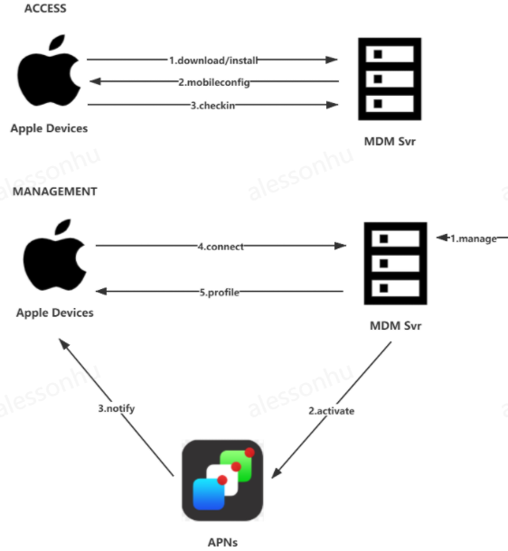

### MDM服务器代码
  

服务名：
+ mdm_svr 

主要功能：

+ 接入文件下载(enroll)
+ 设备接入(checkin)
+ 唤醒设备(activate)
+ 设备连接(connect)

使用：  
```
Usage of ./mdm_svr:  
  -connCert string  
        Connect cert path, such as ./svr.svr  
  -connDomain string  
    	Mdm server address, such as https://testngn.ioatest.net:28800  
  -connKey string  
    	Connect key path, such as ./svr.key  
  -connPass string
    	Connect cert password. (default "123456")
  -orgName string
    	Mdm push organization. (default "ioa")
  -pushPass string
    	Mdm push cert password. (default "keystore")
  -pushPath string
    	Mdm push cert path, such as ./keystore.p12
  -redisAddr string
    	Redis Addr, such as 127.0.0.1:16379
  -redisPass string
    	Redis Password.
  -svrAddr string
    	Svr :Port, such as :28800 (default ":28800")
  such as:
    ./mdm_svr_run -svrAddr=":28800" -connPass="123456" -connCert="./svr.crt" -connKey='./svr.key' -pushPass="keystore" -pushPath="./keystore.p12" -redisAddr="127.0.0.1:16379" -redisPass="" -connAddr="https://testngn.ioatest.net:28800"
```

***
参考文档：https://iwiki.woa.com/pages/viewpage.action?pageId=517347935
